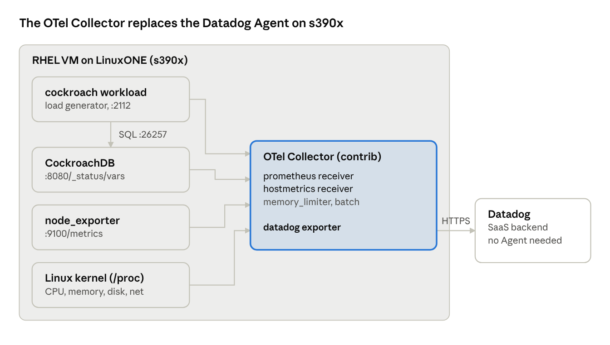

# LinuxONE (s390x) Observability with Datadog and the OpenTelemetry Collector

## Overview

This demo sends metrics from a Linux on IBM Z / LinuxONE (s390x) RHEL VM into Datadog without requiring the Datadog Agent, which is not supported on s390x. The OpenTelemetry (OTel) Collector runs natively on the VM, scrapes host and Prometheus metrics, and forwards them with Datadog's own exporter.

By the end you will have:

- Host metrics (CPU, memory, disk, network) from the s390x VM in Datadog.
- Prometheus metrics from node_exporter in Datadog, showing existing Prometheus setups can be reused.
- CockroachDB running on s390x under a generated load, with throughput and p50/p95/p99 latency in Datadog.
- A ready-made Datadog dashboard showing all of it together.



Everything left of Datadog runs on the s390x VM. Only the Collector talks to Datadog, over HTTPS with an API key.

**Time needed:** about 60 to 90 minutes, starting from a running RHEL s390x VM.

**Versions used in this demo:** OTel Collector contrib v0.162.0, node_exporter v1.12.0, CockroachDB v26.2.5.

### Files in this repo

| Path | What it is |
| --- | --- |
| `config/otel-hostmetrics.yaml` | Collector config for Part 3 (host metrics only) |
| `config/otel-full.yaml` | Collector config for Part 5.3 (host, node_exporter, CockroachDB, load generator) |
| `scripts/start-cockroach.sh` | Starts CockroachDB with memory sized to the VM (Part 5.2) |
| `dashboards/linuxone-crdb-dashboard.json` | Datadog dashboard to import (Part 6) |
| `docs/LinuxONE-Datadog-OTel-Demo.docx` | This guide as a Word document |

Every step below can also be pasted straight into the VM, so cloning the repo onto the VM is optional.

## Prerequisites

| Item | Requirement | Notes |
| --- | --- | --- |
| VM | RHEL on s390x, with sudo access | Tested on an IBM TechZone RHEL VM. Red Hat registration is not required. |
| VM size | 2 vCPU / 4 GB RAM minimum; 4+ vCPU / 8 GB+ recommended | 2 vCPU works for the demo with the memory caps below; use a larger VM for any numbers you plan to share. |
| Disk | 20 GB free | CockroachDB data plus downloads. |
| Network | Outbound HTTPS to github.com, binaries.cockroachdb.com and your Datadog site | If the VM needs a proxy, set `HTTPS_PROXY` for the shell and for the Collector service. |
| Datadog | Datadog account (a free trial works), an API key and your site | Use an API key, not an Application key. |
| SSH | A terminal session on the VM | Add `-o ServerAliveInterval=60` to `ssh` to stop idle sessions dropping. |

**Every command in this guide runs on the VM.** Before each part, ensure `uname -m` prints `s390x`.

## Part 1: Verify the VM and gather Datadog details

Confirm the architecture, resources and network access before installing anything.

```bash
uname -m                    # expect: s390x
cat /etc/redhat-release     # RHEL version
nproc; free -g; df -h /     # CPUs, memory, free disk
sudo whoami                 # expect: root
curl -sI https://github.com | head -1          # expect an HTTP 200 line
curl -sI https://api.datadoghq.com | head -1   # any HTTP response = reachable
```

If either `curl` hangs, the VM has no outbound access. Fix that first; nothing else will work without it.

You may see a login banner asking you to register with Red Hat (`rhc connect`). You can ignore it: every package in this demo is installed directly, not from Red Hat repositories.

### Get your Datadog API key and site

1. In Datadog, open **Organization Settings → API Keys** and copy an API key.
2. Find your respective site value from the browser URL:

| Browser URL starts with | Site value |
| --- | --- |
| `app.datadoghq.com` | `datadoghq.com` |
| `us3.datadoghq.com` | `us3.datadoghq.com` |
| `us5.datadoghq.com` | `us5.datadoghq.com` |
| `app.datadoghq.eu` | `datadoghq.eu` |
| `ap1.datadoghq.com` | `ap1.datadoghq.com` |

## Part 2: Install the OpenTelemetry Collector (contrib) on s390x

Install the **contrib** build. The core build (`otelcol`) does not include the Datadog exporter.

```bash
VER=0.162.0
FILE=otelcol-contrib_${VER}_linux_s390x.rpm
BASE=https://github.com/open-telemetry/opentelemetry-collector-releases/releases/download
curl -fLO "$BASE/v$VER/$FILE"
ls -lh "$FILE"            # expect about 94 MB
sudo rpm -ivh "$FILE"
otelcol-contrib --version  # expect 0.162.0
```

The RPM installs a systemd service named `otelcol-contrib`, a config file at `/etc/otelcol-contrib/config.yaml`, and an environment file at `/etc/otelcol-contrib/otelcol-contrib.conf`.

On the GitHub release page, s390x files are sometimes hidden until you click **Show all assets**. A 404 almost always means the URL was mistyped or wrapped during copy and paste.

### Store the Datadog credentials

Replace both placeholders, then paste the block. The key goes in the service's environment file, not the config.

```bash
sudo tee -a /etc/otelcol-contrib/otelcol-contrib.conf <<'EOF'
DD_API_KEY=PASTE_YOUR_API_KEY_HERE
DD_SITE=datadoghq.com
EOF
sudo chmod 600 /etc/otelcol-contrib/otelcol-contrib.conf
sudo cat /etc/otelcol-contrib/otelcol-contrib.conf   # check: no spaces around =, no quotes
```

## Part 3: Send host metrics to Datadog and verify

This config collects the VM's CPU, memory, load, disk, filesystem, network and swap metrics every 30 seconds and sends them to Datadog. The utilization metrics are switched on because Datadog's host views depend on them. The same config is in [`config/otel-hostmetrics.yaml`](config/otel-hostmetrics.yaml).

```bash
sudo tee /etc/otelcol-contrib/config.yaml <<'EOF'
receivers:
  hostmetrics:
    collection_interval: 30s
    scrapers:
      cpu:
        metrics:
          system.cpu.utilization:
            enabled: true
      memory:
        metrics:
          system.memory.utilization:
            enabled: true
      load: {}
      disk: {}
      filesystem:
        metrics:
          system.filesystem.utilization:
            enabled: true
      network: {}
      paging: {}

processors:
  memory_limiter:
    check_interval: 1s
    limit_mib: 300
    spike_limit_mib: 80
  resourcedetection:
    detectors: [system]
  batch: {}

exporters:
  datadog:
    api:
      key: ${env:DD_API_KEY}
      site: ${env:DD_SITE}

service:
  pipelines:
    metrics:
      receivers: [hostmetrics]
      processors: [memory_limiter, resourcedetection, batch]
      exporters: [datadog]
EOF
```

Validate with the credentials loaded, then start the service. Running `validate` on its own fails with `api.key is not set`, because only the service reads the environment file.

```bash
sudo bash -c 'set -a; source /etc/otelcol-contrib/otelcol-contrib.conf; otelcol-contrib validate --config=/etc/otelcol-contrib/config.yaml'; echo "exit code: $?"
sudo systemctl restart otelcol-contrib
sudo systemctl enable otelcol-contrib
sudo systemctl status otelcol-contrib --no-pager   # expect: active (running)
sudo journalctl -u otelcol-contrib -n 30 --no-pager # look for errors
```

**Verify in Datadog** (allow 2 to 5 minutes):

1. Navigate to **Infrastructure → Host List.** The VM's hostname should appear.
2. Navigate to **Metrics → Explorer.** Type `system.cpu` in the metric box and pick `system.cpu.time` or `system.cpu.utilization`. A line on the graph confirms data is flowing.

Datadog's default host dashboard expects Datadog Agent metric names, so some of its widgets stay empty. That is expected; Part 6 provides a dashboard built for these metrics.

## Part 4: Add Prometheus metrics via node_exporter

node_exporter is the standard Prometheus exporter for Linux host metrics. It stands in for any Prometheus endpoint a client already runs; the Collector scrapes it with ordinary Prometheus `scrape_configs`.

```bash
NE_VER=1.12.0
curl -fLO https://github.com/prometheus/node_exporter/releases/download/v${NE_VER}/node_exporter-${NE_VER}.linux-s390x.tar.gz
tar xzf node_exporter-${NE_VER}.linux-s390x.tar.gz
sudo cp node_exporter-${NE_VER}.linux-s390x/node_exporter /usr/local/bin/
nohup /usr/local/bin/node_exporter > /tmp/node_exporter.log 2>&1 &
curl -s localhost:9100/metrics | head -2   # expect '# HELP' and '# TYPE' lines
```

`nohup` keeps node_exporter running until the VM reboots. After a reboot, rerun the `nohup` line.

The Prometheus scrape job is added together with the CockroachDB jobs in Part 5, so the Collector config is replaced only once more. If you are stopping after this part, add this under `receivers:` in the Part 3 config and set the pipeline to `receivers: [hostmetrics, prometheus]`:

```yaml
  prometheus:
    config:
      scrape_configs:
        - job_name: linuxone-node
          scrape_interval: 30s
          static_configs:
            - targets: ['localhost:9100']
```

**Verify in Datadog:** in Metrics Explorer, type `node_` and pick `node_load1` or `node_memory_MemAvailable_bytes`. These names come from node_exporter, so their presence proves the Prometheus path works. The scrape job name, `linuxone-node`, appears as a tag on each metric.

## Part 5: Run CockroachDB and drive load

CockroachDB and its built-in load generator (`cockroach workload`) both expose Prometheus metrics. The Collector scrapes both, so database throughput and client-side latency land in Datadog beside the host metrics.

### 5.1 Install CockroachDB for s390x

```bash
CRDB_VER=v26.2.5
curl -fLO https://binaries.cockroachdb.com/cockroach-${CRDB_VER}.linux-s390x.tgz && echo "Download OK"
tar xzf cockroach-${CRDB_VER}.linux-s390x.tgz
sudo cp cockroach-${CRDB_VER}.linux-s390x/cockroach /usr/local/bin/
cockroach version   # expect: Platform: linux s390x
```

### 5.2 Start a single node with memory sized to the VM

The same steps are in [`scripts/start-cockroach.sh`](scripts/start-cockroach.sh).

```bash
sudo mkdir -p /var/lib/cockroach && sudo chown $USER /var/lib/cockroach

# Size CockroachDB's memory to this VM
MEM_MB=$(awk '/MemTotal/ {print int($2/1024)}' /proc/meminfo)
if [ "$MEM_MB" -lt 8192 ]; then
  CACHE_PCT=10; SQL_PCT=15    # under 8 GB: leave room for the Collector and load generator
else
  CACHE_PCT=25; SQL_PCT=25    # 8 GB or more: Cockroach Labs' production recommendation
fi
CACHE_MB=$(( MEM_MB * CACHE_PCT / 100 ))
SQL_MB=$(( MEM_MB * SQL_PCT / 100 ))
echo "VM memory: ${MEM_MB} MiB -> cache ${CACHE_MB} MiB, SQL memory ${SQL_MB} MiB"

cockroach start-single-node --insecure \
  --store=/var/lib/cockroach \
  --listen-addr=localhost:26257 --http-addr=localhost:8080 \
  --cache=${CACHE_MB}MiB --max-sql-memory=${SQL_MB}MiB \
  --background
cockroach sql --insecure --host=localhost:26257 -e "select version();"
curl -s localhost:8080/_status/vars | head -3   # Prometheus-format lines
```

- The script reads the VM's total memory from `/proc/meminfo` and sizes `--cache` and `--max-sql-memory` from it, so the same commands work on any VM. The `echo` line shows what it chose.
- Under 8 GB it uses 10% for cache and 15% for SQL memory (about 370 and 550 MiB on a 4 GB VM). That leaves room for the Collector, node_exporter and the load generator, which share the VM.
- At 8 GB or more it uses 25% each, Cockroach Labs' recommended production setting (for example 4 GiB each on a 16 GB VM).
- To override, set `CACHE_PCT` and `SQL_PCT` yourself and rerun from the `CACHE_MB` line.
- `--insecure` skips TLS and is bound to `localhost`. It suits a demo VM only.

### 5.3 Point the Collector at everything

This replaces the whole config: host metrics, node_exporter, CockroachDB (port 8080, path `/_status/vars`) and the load generator (port 2112). The same config is in [`config/otel-full.yaml`](config/otel-full.yaml).

```bash
sudo tee /etc/otelcol-contrib/config.yaml <<'EOF'
receivers:
  hostmetrics:
    collection_interval: 30s
    scrapers:
      cpu:
        metrics:
          system.cpu.utilization:
            enabled: true
      memory:
        metrics:
          system.memory.utilization:
            enabled: true
      load: {}
      disk: {}
      filesystem:
        metrics:
          system.filesystem.utilization:
            enabled: true
      network: {}
      paging: {}
  prometheus:
    config:
      scrape_configs:
        - job_name: linuxone-node
          scrape_interval: 30s
          static_configs:
            - targets: ['localhost:9100']
        - job_name: cockroachdb
          scrape_interval: 15s
          metrics_path: /_status/vars
          static_configs:
            - targets: ['localhost:8080']
        - job_name: crdb-workload
          scrape_interval: 15s
          static_configs:
            - targets: ['localhost:2112']

processors:
  memory_limiter:
    check_interval: 1s
    limit_mib: 300
    spike_limit_mib: 80
  resourcedetection:
    detectors: [system]
  batch: {}

exporters:
  datadog:
    api:
      key: ${env:DD_API_KEY}
      site: ${env:DD_SITE}

service:
  pipelines:
    metrics:
      receivers: [hostmetrics, prometheus]
      processors: [memory_limiter, resourcedetection, batch]
      exporters: [datadog]
EOF

sudo bash -c 'set -a; source /etc/otelcol-contrib/otelcol-contrib.conf; otelcol-contrib validate --config=/etc/otelcol-contrib/config.yaml'; echo "exit code: $?"
sudo systemctl restart otelcol-contrib
sudo systemctl status otelcol-contrib --no-pager
```

Until a workload is running, the Collector log shows scrape errors for `localhost:2112`. That is expected.

### 5.4 Create the test data and run the load

The connection URL starts with `postgresql://` because CockroachDB speaks the PostgreSQL wire protocol; it connects to CockroachDB on port 26257, not to PostgreSQL.

```bash
URL='postgresql://root@localhost:26257?sslmode=disable'
cockroach workload init kv "$URL"

nohup cockroach workload run kv \
  --duration=10m --concurrency=4 --read-percent=95 \
  --prometheus-port=2112 "$URL" > /tmp/kv-run.log 2>&1 &

tail -f /tmp/kv-run.log   # Ctrl+C stops watching; the load keeps running
```

The run lasts 10 minutes with 4 concurrent workers and a 95% read / 5% write mix. Running it with `nohup` keeps it going if the SSH session drops.

Each log line covers one second: **ops/sec(inst)** is throughput and **p50(ms) / p95(ms) / p99(ms) / pMax(ms)** are latency. When the run ends, `tail -20 /tmp/kv-run.log` shows the summary.

### 5.5 Verify in Datadog

| What | Metric to search |
| --- | --- |
| Database throughput | `sql_select_count`, `sql_insert_count`, `sql_query_count` |
| Database-side latency | `sql_service_latency` |
| Client-side latency | `workload_kv_read_duration_seconds`, `workload_kv_write_duration_seconds` |
| VM load | `system.cpu.utilization`, `system.memory.utilization` |

Latency metrics arrive as Datadog **distributions**. To see p95 or p99:

1. Open **Metrics → Summary**, search for the specific metric you are looking for (i.e. `workload_kv_read_duration_seconds` or `workload_kv_write_duration_seconds`, and enable percentiles for the specific metric. You have to do this for every metric you wish to see percentile data for. 
2. Start a **new** workload run. Percentiles only apply to data received after they are enabled.
3. In Metrics Explorer, choose **p95** or **p99** as the aggregation. Values are in seconds; add a formula `a * 1000` to show milliseconds.

In Metrics Explorer, `sum by … as count` on a duration metric shows how many operations ran, not how long they took.

## Part 6: Import the Datadog dashboard and run the demo

The dashboard has three groups: workload latency (client view), CockroachDB throughput and latency (database view), and the LinuxONE host, including CPU **steal** time. A host selector at the top lets the same dashboard cover more VMs later.

### Import it

1. In Datadog, open **Dashboards → New Dashboard** and create an empty dashboard.
2. Open the **gear** or **…** menu at the top right and choose **Import dashboard JSON**.
3. Paste the contents of [`dashboards/linuxone-crdb-dashboard.json`](dashboards/linuxone-crdb-dashboard.json) and confirm.

If a widget shows **No data**: enable percentiles for latency metrics (Part 5.5) and run a fresh workload, check that CockroachDB is running, or open the widget's editor and pick the matching metric name from the dropdown.

### Run the demo

1. Open the dashboard and set the time range to **Past 15 Minutes**, with live updates on.
2. Put a terminal running `tail -f` on the workload log beside it.
3. Start a workload run (Part 5.4) and narrate as the latency, SQL throughput and CPU graphs move together, about 30 to 60 seconds behind the terminal.
4. Optional: rerun at `--concurrency=8` or `--read-percent=50` to show how throughput and p99 latency respond.

## Troubleshooting

| Symptom | Likely cause | Fix |
| --- | --- | --- |
| `nproc: command not found`, or `df` shows `/dev/disk3s1s1` | Commands are running on your laptop, not the VM | Reconnect with `ssh`, check `uname -m` prints `s390x` |
| `curl` download returns 404 | URL mistyped or wrapped during copy | Build it from variables as shown; check the asset on the release page under **Show all assets** |
| `unknown type: "datadog"` | Core `otelcol` installed instead of `otelcol-contrib` | Install the contrib RPM |
| `api.key is not set` from `validate` | The shell has not loaded the environment file | Use the `sudo bash -c 'set -a; source …'` form of `validate` |
| `403 Forbidden` in the Collector log | Wrong key, or an Application key | Use an API key from Organization Settings → API Keys |
| No data in Datadog, no errors in the log | `DD_SITE` does not match the account's region | Match the site to the browser URL (Part 1) |
| Datadog's host dashboard is mostly empty | It expects Datadog Agent metric names | Use Metrics Explorer or the Part 6 dashboard |
| No `node_` metrics | node_exporter stopped, often after a reboot | Rerun the `nohup` line in Part 4 |
| p95/p99 graph is empty | Percentiles not enabled, or enabled after the run ended | Enable percentiles, then start a new run |
| CockroachDB exits or the VM slows down | Out of memory | Lower `CACHE_PCT` and `SQL_PCT` in Part 5.2 (for example 8 and 12), then restart CockroachDB |
| `connection refused` on port 26257 | CockroachDB is not running | Check `pgrep -af cockroach`, rerun Part 5.2 |
| Workload errors about the `kv` database | `workload init` did not complete | Rerun `cockroach workload init kv "$URL"` |
| SSH session keeps dropping | Idle timeout | Add `-o ServerAliveInterval=60`; long runs use `nohup` so they keep going |

To see the Collector's latest errors: `sudo journalctl -u otelcol-contrib -n 50 --no-pager`.

## Cleanup and next steps

### Stop everything

```bash
pkill -f "cockroach workload"      # stop any running load
pkill -INT -f "cockroach start"    # shut CockroachDB down cleanly
pkill node_exporter
sudo systemctl stop otelcol-contrib
sudo systemctl disable otelcol-contrib
```

### Where to go next

- **Logs:** add a `filelog` receiver for `/var/lib/cockroach/logs` and a logs pipeline to the `datadog` exporter.
- **Traces:** run a Java app with the OpenTelemetry Java agent pointed at the Collector to get Datadog APM traces from s390x.
- **Multi-node:** three VMs and a node failure under load to show CockroachDB resilience.
